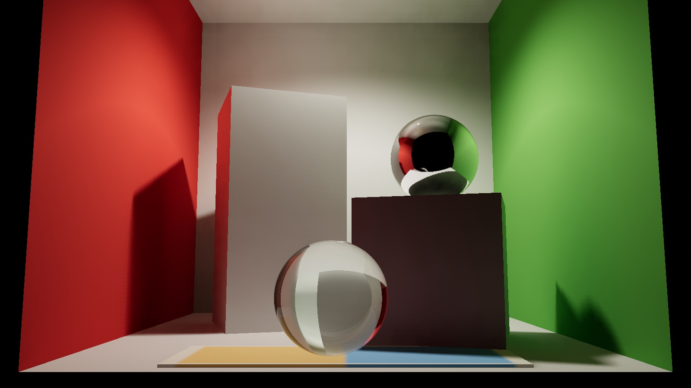
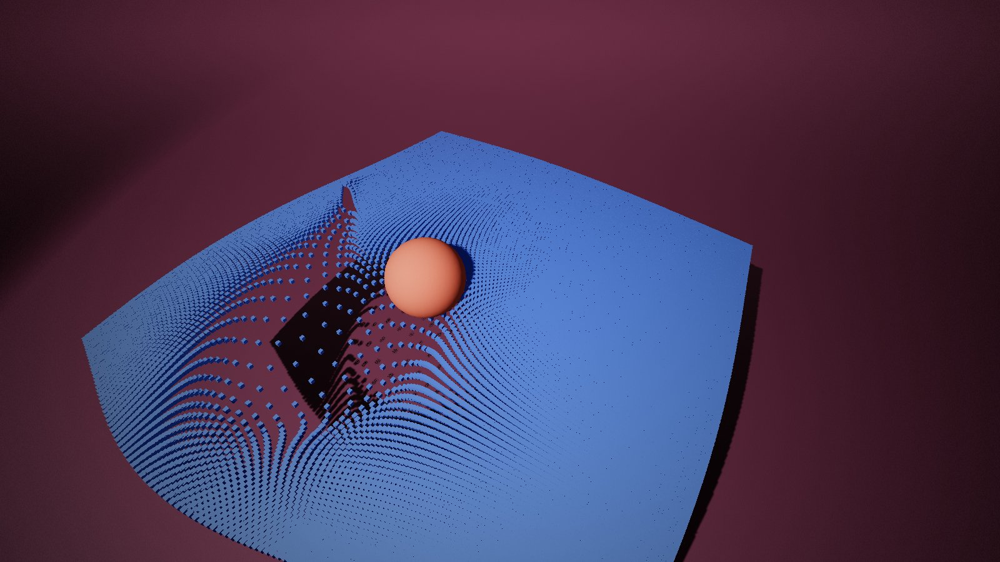
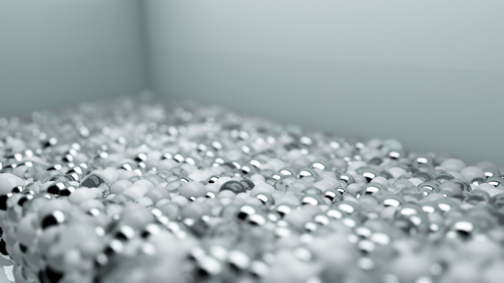
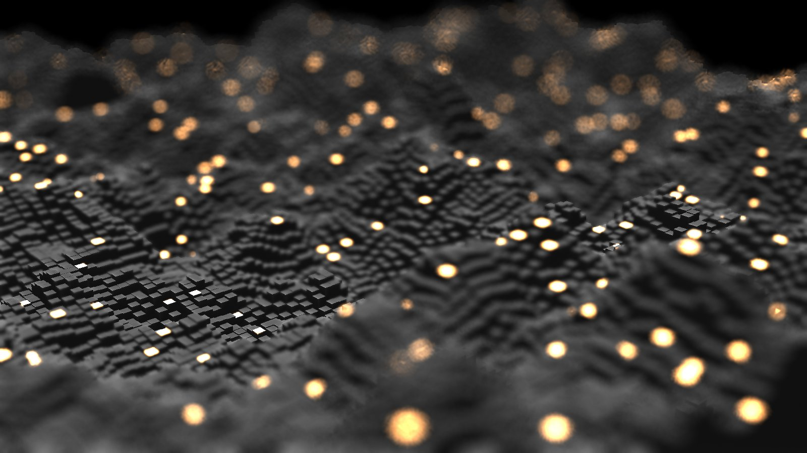
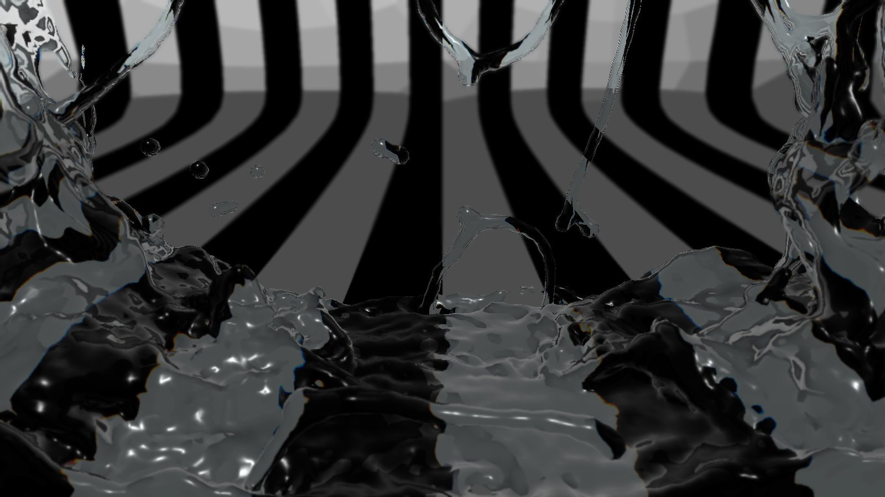

# kansei

<!-- Gallery: two cells per <tr>, each image a ~1600 px wide JPEG under 300 KB in docs/media/readme/
     linking to its live example. To add an entry, add a <td> (start a new <tr> after every two);
     an odd last entry can take colspan="2" as a wide hero. -->
<table>
  <tr>
    <td width="50%" valign="top">
      <a href="https://kansei.graphics/examples/gi-box/"></a><br>
      <a href="https://kansei.graphics/examples/gi-box/"><b>GI box</b></a><br>
      <sub>A Cornell box under hybrid ray-traced GI, with a ray-traced chrome ball and a glass ball</sub>
    </td>
    <td width="50%" valign="top">
      <a href="https://kansei.graphics/examples/instancing/"></a><br>
      <a href="https://kansei.graphics/examples/instancing/"><b>Instancing</b></a><br>
      <sub>A ball pushes through a carpet of instanced cubes, simulated in compute</sub>
    </td>
  </tr>
  <tr>
    <td width="50%" valign="top">
      <a href="https://kansei.graphics/examples/voxel-gi-particles/?rt=on&amp;dof=1"></a><br>
      <a href="https://kansei.graphics/examples/voxel-gi-particles/?rt=on&amp;dof=1"><b>Voxel GI on particles</b></a><br>
      <sub>An SPH pile lit by voxel cone tracing, with ray-traced mirror and glass spheres and depth of field</sub>
    </td>
    <td width="50%" valign="top">
      <a href="https://kansei.graphics/examples/depth-of-field/"></a><br>
      <a href="https://kansei.graphics/examples/depth-of-field/"><b>Depth of field</b></a><br>
      <sub>Physical lens depth of field with bokeh on a scrolling field of glowing columns</sub>
    </td>
  </tr>
  <tr>
    <td width="50%" valign="top">
      <a href="https://kansei.graphics/examples/fluid/"></a><br>
      <a href="https://kansei.graphics/examples/fluid/"><b>Fluid</b></a><br>
      <sub>A 3D particle fluid splashing in a box, meshed with marching cubes and refracting the room</sub>
    </td>
  </tr>
</table>

Live examples: [kansei.graphics](https://kansei.graphics/) · [all examples](https://kansei.graphics/examples/)

Kansei is a WebGPU engine for real-time rendering and GPU simulation, written twice: once in
TypeScript for the browser and once in Rust for the browser (WebAssembly) and the desktop. Both
engines share their WGSL shaders and are kept at feature parity.

It is a personal, experimental engine rather than a general-purpose one: expect APIs to change.

## Contents

- [Overview](#overview)
- [Features](#features)
- [Getting started: TypeScript](#getting-started-typescript)
- [Getting started: Rust](#getting-started-rust)
- [Running the examples locally](#running-the-examples-locally)
- [Repository layout](#repository-layout)
- [Tests](#tests)
- [Documentation and links](#documentation-and-links)
- [License](#license)

## Overview

| Engine | Where | Runs on | Use it from |
|---|---|---|---|
| TypeScript | `src/` | Browsers with WebGPU | TS/JS, bundled with Vite or any ESM bundler |
| Rust | `rust/kansei-core` | Native (Vulkan, Metal, DX12) and browsers (WebGPU), through `wgpu` 24 | Rust: `kansei-wasm` for the web, your own window loop (e.g. `winit`) for desktop |

The two engines are one design with two implementations:

- **Shared WGSL.** The shaders live in `rust/kansei-core/src`. The TS engine imports many of
  them as raw strings at build time (Vite `?raw`) and assembles them the way Rust does, so both
  engines run the same shader code. An edit to one of those shaders changes both engines.
- **The same API shape.** `Renderer`, `Scene`, `Renderable`, `Material`, `Camera`, lights,
  `PostProcessingVolume` and its effects have the same names and roles in both engines
  (`camelCase` in TS, `snake_case` in Rust). Most examples exist in both, side by side on the
  examples page.
- **The same results.** The TS tests are the Rust `#[test]`s ported one for one. The TS cluster
  LOD builder builds Rust's cluster graph word for word, and motion matching picks the same
  frames in both.

Design goals:

- **WebGPU and WGSL first.** No WebGL fallback. Compute shaders do the heavy work: simulation,
  culling, LOD selection, voxelization, ray tracing, denoising.
- **Modern real-time techniques at web scale.** A deferred GBuffer, temporal anti-aliasing,
  clustered lights, GPU-driven culling and cluster LOD, voxel and ray-traced GI, sized for a
  laptop or phone browser.
- **Every feature has an example.** Each engine feature is shown by a small page that teaches
  it, and the bigger demos combine them.
- **Composable WGSL.** Stock materials cover the common cases; custom shaders compose the
  engine's WGSL chunks (lights, shadows, GBuffer output, GI) instead of redeclaring bindings.

## Features

Both engines have these features unless an item says otherwise.

**Rendering**
- Scene graph of `Renderable`s, instanced geometry, primitives (box, plane, sphere, cylinder,
  icosphere, heightfield) and custom geometry
- Stock materials: `basic_lit` (forward Blinn-Phong) and `standard_lit` (GBuffer: lights,
  shadows, sky hemisphere, emission, instancing, mirror and glass), `emissive`, `gradient_sky`;
  custom WGSL materials and compute passes
- Forward or deferred rendering: a single-sample GBuffer with motion vectors, or MSAA forward
- Orbit camera controls, a frame loop that caps frames in flight, fixed-step simulation pacing
- GPU profiling: per-pass GPU times and the frame's CPU sections

**Lighting and shadows**
- Directional, point, spot and area lights; clustered light lists for many spot lights
- Directional shadow maps, cascaded shadows, point-light cube shadows and a spot shadow atlas,
  with contact-hardening penumbrae
- Physically based sky atmosphere (Hillaire's LUTs, aerial perspective), froxel volumetric fog
  with local fog volumes

**Global illumination and ray tracing**
- Voxel GI: scene voxelization through each material's own vertex shader, cone tracing, a
  distance field and irradiance probes; a clipmap around the camera for large outdoor scenes
- Screen-space GI
- Ray tracing on a GPU-built grid of the scene's triangles around the camera: hybrid diffuse GI
  (rays plus voxel GI for further bounces, SVGF denoising, a reference path-tracing mode),
  reflections, and mirror and glass materials (Fresnel, refraction, frosted glass)
- A BVH path tracer (the path-traced Cornell box example)

**Post-processing**
- Physical tone mapping with EV100 exposure and film curves, colour grading, bloom
- Temporal AA, motion blur, SSAO, god rays (TS)
- Physical-lens depth of field with scattered bokeh

**Visibility, LOD and reflections**
- GPU instance culling per view (camera, shadow cascades, reflections): frustum, LOD bands and
  two-phase occlusion against a depth pyramid
- Cluster LOD (meshlets): a cluster graph built on the CPU and cut per view on the GPU
- Octahedral impostors baked at start-up
- Planar reflections with an oblique clip plane

**Simulation**
- GPU particle fluids: SPH or Position Based Fluids on a shared neighbour grid, colliders,
  shaped containers, emitters, sleeping at rest
- Fluid surfaces meshed by marching cubes over a splatted density or a surface field,
  refracting the scene
- Compute particles and a generic GPU neighbour grid for other particle systems

**Animation**
- Skeletal skinning in the materials' vertex shaders
- Motion matching, inertialization, foot IK and warping (`rust/kansei-anim-bake` bakes the
  motion packs; packs derived from third-party animation never ship in this repository)

**Loaders, text and tools**
- glTF/GLB, KTX2 (Basis Universal ETC1S and UASTC, transcoded to the best format each device
  samples), images, and video textures (TS)
- MSDF text from `.arfont` atlases (generate one at [msdf.kansei.graphics](https://msdf.kansei.graphics/))
- `rust/tools/ktx2` encodes textures to KTX2 ([docs/ktx2.md](docs/ktx2.md))

## Getting started: TypeScript

### Install

```bash
npm install kansei
```

`kansei` 0.1.0 is the TypeScript engine described here; it brings `gl-matrix` as a dependency
and `@webgpu/types` as a peer dependency (npm 7+ and pnpm install it for you). Its declarations
load the WebGPU types, so TypeScript needs no `"types"` entry for them. Upgrading from 0.0.11?
Custom shaders change: see the [changelog](CHANGELOG.md#breaking-changes-and-how-to-migrate).

The package is ES modules for a bundler (Vite or any other). The examples below use top-level
`await`; with Vite, build for a target that has it:

```js
// vite.config.js
export default { build: { target: 'es2022' } };
```

To work on the engine itself, or use what is on `development` before a release, build the
package from the repository (Node 24, pnpm) and install that folder instead:

```bash
git clone https://github.com/Siroko/kansei
cd kansei
pnpm install
pnpm build            # type-checks and writes dist/
cd ../your-app && npm install ../kansei
```

### A first scene

A floor and a spinning box under a sun with shadows, and an orbit camera (drag to orbit, wheel
to zoom). The module uses top-level `await`, so load it as `<script type="module">` through
Vite or another ESM bundler.

```ts
import {
    Canvas, run, Scene, Renderable, Material, BoxGeometry, PlaneGeometry,
    DirectionalLight, Camera, CameraControls, Vector3,
} from 'kansei';

const canvas = Canvas.fill();
const renderer = await canvas.renderer({ sampleCount: 4 });
renderer.enableShadows({ resolution: 2048 });

const scene = new Scene();
const floor = new Renderable(new PlaneGeometry(20, 20), Material.basicLit('Floor', [0.6, 0.6, 0.6, 1], [0.2, 0.2, 0.2, 0.1]));
floor.rotation.x = -Math.PI / 2;
scene.add(floor);

const box = new Renderable(new BoxGeometry(1.6, 1.6, 1.6), Material.basicLit('Box', [1, 0.35, 0.2, 1], [0.5, 0.5, 0.5, 0.4]));
box.position.set(0, 0.8, 0);
scene.add(box);

const sun = new DirectionalLight([-0.4, -1, -0.5], [1, 0.95, 0.9], 1);
sun.castShadow = true;
scene.add(sun);

const camera = new Camera(45, 0.1, 100, canvas.aspect);
const controls = new CameraControls(camera, new Vector3(0, 0.8, 0), renderer.canvas, 9);
controls.elevation = 0.35;

run(canvas, (frame) => {
    frame.resize(renderer, camera);
    box.rotation.y = frame.time * 0.6;
    controls.update(frame.dt);
    renderer.render(scene, camera);
});
```

`Canvas` sizes the drawing buffer to the canvas's CSS box and device pixel ratio and follows
resizes; `run` drives the frame loop. Next, try
[`examples/index_hello_scene.html`](examples/index_hello_scene.html) (the same scene with point
lights, `?post=1` for bloom and colour grading, `?standard=1` for the GBuffer materials), then
the other `examples/index_*.html` pages.

## Getting started: Rust

The Rust engine is three crates in the `rust/` workspace:

| Crate | What it is |
|---|---|
| `kansei-core` | The engine: renderer, scene, materials, effects, simulation, animation. Platform-neutral, on `wgpu` 24 and `glam` 0.29 (re-exported as `kansei_core::math`). |
| `kansei-wasm` | The web runtime every browser example shares: canvas sizing, the frame loop, query parameters, fetch, input, and running an example in a Web Worker. |
| `kansei-native` | The desktop examples (`rust/kansei-native/examples`), on `winit`. |

### Add the dependency

The crates are not on crates.io (the `kansei` crate there is an unrelated project). Depend on
them from git:

```toml
[dependencies]
kansei-core = { git = "https://github.com/Siroko/kansei", branch = "main" }
```

`main` is what [kansei.graphics](https://kansei.graphics/) runs; active development lands on
`development` first. Pin a `rev = "..."` for reproducible builds.

### Native

Run the native examples from the workspace:

```bash
cd rust
cargo run -p kansei-native --example hello_scene      # -- --post for bloom and grading
cargo run --release -p kansei-native --example fluid_3d
```

In your own app, `kansei-core` renders into any `wgpu` surface target, such as a `winit`
window. A complete app (Cargo dependencies: `kansei-core` as above, `winit = "0.30"`,
`pollster = "0.4"`):

```rust
use std::sync::Arc;

use kansei_core::cameras::Camera;
use kansei_core::controls::CameraControls;
use kansei_core::geometries::{BoxGeometry, PlaneGeometry};
use kansei_core::lights::{DirectionalLight, Light};
use kansei_core::materials::Material;
use kansei_core::math::Vec3;
use kansei_core::objects::{Renderable, Scene, SceneNode};
use kansei_core::renderers::{Renderer, RendererConfig};
use winit::application::ApplicationHandler;
use winit::event::WindowEvent;
use winit::event_loop::{ActiveEventLoop, EventLoop};
use winit::window::{Window, WindowId};

struct Running { window: Arc<Window>, renderer: Renderer, scene: Scene, camera: Camera, controls: CameraControls }

#[derive(Default)]
struct App { running: Option<Running> }

impl ApplicationHandler for App {
    fn resumed(&mut self, el: &ActiveEventLoop) {
        if self.running.is_some() { return; }
        let window = Arc::new(el.create_window(Window::default_attributes().with_title("Kansei")).unwrap());
        let size = window.inner_size();
        let mut renderer = Renderer::new(RendererConfig { width: size.width, height: size.height, sample_count: 4, ..Default::default() });
        pollster::block_on(renderer.initialize_with_target(window.clone()));
        renderer.enable_shadows(2048);

        let mut scene = Scene::new();
        let mut floor = Renderable::new(PlaneGeometry::new(20.0, 20.0), Material::basic_lit("Floor", [0.6, 0.6, 0.6, 1.0], [0.2, 0.2, 0.2, 0.1]));
        floor.object.rotation.x = -std::f32::consts::FRAC_PI_2;
        scene.add(SceneNode::Renderable(floor));
        let mut cube = Renderable::new(BoxGeometry::new(1.6, 1.6, 1.6), Material::basic_lit("Box", [1.0, 0.35, 0.2, 1.0], [0.5, 0.5, 0.5, 0.4]));
        cube.object.set_position(0.0, 0.8, 0.0);
        scene.add(SceneNode::Renderable(cube));
        let mut sun = DirectionalLight::new(Vec3::new(-0.4, -1.0, -0.5), Vec3::new(1.0, 0.95, 0.9), 1.0);
        sun.cast_shadow = true;
        scene.add(SceneNode::Light(Light::Directional(sun)));

        let camera = Camera::new(45.0, 0.1, 100.0, size.width as f32 / size.height.max(1) as f32);
        let mut controls = CameraControls::new(Vec3::new(0.0, 0.8, 0.0), 9.0);
        controls.set_elevation(0.35);
        self.running = Some(Running { window, renderer, scene, camera, controls });
    }

    fn window_event(&mut self, el: &ActiveEventLoop, _: WindowId, event: WindowEvent) {
        let Some(app) = &mut self.running else { return };
        match event {
            WindowEvent::CloseRequested => el.exit(),
            WindowEvent::Resized(s) => {
                app.renderer.resize(s.width.max(1), s.height.max(1));
                app.camera.aspect = s.width.max(1) as f32 / s.height.max(1) as f32;
                app.camera.update_projection_matrix();
            }
            WindowEvent::RedrawRequested => {
                app.controls.update(&mut app.camera, 0.0);
                app.renderer.render(&mut app.scene, &mut app.camera);
                app.window.request_redraw();
            }
            _ => {}
        }
    }
}

fn main() {
    EventLoop::new().unwrap().run_app(&mut App::default()).unwrap();
}
```

[`rust/kansei-native/examples/hello_scene.rs`](rust/kansei-native/examples/hello_scene.rs) adds
mouse orbiting and post-processing. `Renderer::initialize_headless` renders without a window.

### Web (WebAssembly)

A web app is a `cdylib` crate that exports an async `start` function, built with
[wasm-pack](https://rustwasm.github.io/wasm-pack/) (`rustup target add wasm32-unknown-unknown`
first). Every example in `rust/kansei-wasm/examples` is laid out this way:

```text
my-scene/
├── Cargo.toml        # crate-type = ["cdylib", "rlib"]
├── src/lib.rs        # #[wasm_bindgen] pub async fn start(canvas_id: &str)
└── www/index.html    # imports ../pkg/my_scene.js
```

`Cargo.toml`:

```toml
[package]
name = "my-scene"
version = "0.1.0"
edition = "2021"

[lib]
crate-type = ["cdylib", "rlib"]

[dependencies]
kansei-core = { git = "https://github.com/Siroko/kansei", branch = "main" }
kansei-wasm = { git = "https://github.com/Siroko/kansei", branch = "main" }
wasm-bindgen = "0.2"
wasm-bindgen-futures = "0.4"
```

`src/lib.rs`, the same scene as above:

```rust
use wasm_bindgen::prelude::*;

use kansei_core::cameras::Camera;
use kansei_core::controls::CameraControls;
use kansei_core::geometries::{BoxGeometry, PlaneGeometry};
use kansei_core::lights::{DirectionalLight, Light};
use kansei_core::materials::Material;
use kansei_core::math::Vec3;
use kansei_core::objects::{Renderable, Scene, SceneNode};
use kansei_core::renderers::RendererConfig;
use kansei_wasm::Canvas;

#[wasm_bindgen]
pub async fn start(canvas_id: &str) -> Result<(), JsValue> {
    let canvas = Canvas::find(canvas_id)?;
    let mut renderer = canvas.renderer(RendererConfig { sample_count: 4, ..Default::default() }).await;
    renderer.enable_shadows(2048);

    let mut scene = Scene::new();
    let mut floor = Renderable::new(PlaneGeometry::new(20.0, 20.0), Material::basic_lit("Floor", [0.6, 0.6, 0.6, 1.0], [0.2, 0.2, 0.2, 0.1]));
    floor.object.rotation.x = -std::f32::consts::FRAC_PI_2;
    scene.add(SceneNode::Renderable(floor));
    let mut cube = Renderable::new(BoxGeometry::new(1.6, 1.6, 1.6), Material::basic_lit("Box", [1.0, 0.35, 0.2, 1.0], [0.5, 0.5, 0.5, 0.4]));
    cube.object.set_position(0.0, 0.8, 0.0);
    let cube = scene.add(SceneNode::Renderable(cube));
    let mut sun = DirectionalLight::new(Vec3::new(-0.4, -1.0, -0.5), Vec3::new(1.0, 0.95, 0.9), 1.0);
    sun.cast_shadow = true;
    scene.add(SceneNode::Light(Light::Directional(sun)));

    let mut camera = Camera::new(45.0, 0.1, 100.0, canvas.aspect());
    let mut controls = CameraControls::from_canvas(canvas.element(), Vec3::new(0.0, 0.8, 0.0), 9.0);
    controls.set_elevation(0.35);

    kansei_wasm::run(&canvas, move |frame| {
        frame.resize(&mut renderer, &mut camera);
        if let Some(r) = scene.get_renderable_mut(cube) {
            r.object.rotation.y = frame.time as f32 * 0.6;
        }
        controls.update(&mut camera, frame.dt);
        renderer.render(&mut scene, &mut camera);
    });
    Ok(())
}
```

`www/index.html`:

```html
<!DOCTYPE html>
<html>
<head>
  <meta charset="utf-8">
  <meta name="viewport" content="width=device-width, initial-scale=1">
  <style>body { margin: 0; } canvas { width: 100vw; height: 100vh; display: block; touch-action: none; }</style>
</head>
<body>
  <canvas id="kansei"></canvas>
  <script type="module">
    import init, * as wasm from '../pkg/my_scene.js';
    await init();
    // runs `start('kansei')` on the page, or with ?worker=1 in a Web Worker on an OffscreenCanvas
    await wasm.launch(wasm, { module: new URL('../pkg/my_scene.js', import.meta.url).href });
  </script>
</body>
</html>
```

Build it, serve the crate's folder with any static server and open `www/`:

```bash
wasm-pack build --target web --release
python3 -m http.server 8000      # then open http://localhost:8000/www/
```

What `kansei-wasm` gives an app:

| API | Does |
|---|---|
| `Canvas::find`, `canvas.renderer(config)` | Finds the canvas, sizes its drawing buffer to the CSS box times `devicePixelRatio` (at most 2, or `?dpr=`), creates the renderer |
| `run`, `run_with` | The `requestAnimationFrame` loop. Each `Frame` carries time, delta time and any new size. At most two frames are in flight on the GPU (`RunOptions`, `?inflight=0/1/2`), so frames do not queue up |
| `param`, `param_or`, `flag` | Read the page's query string |
| `fetch_bytes`, `now`, `is_phone`, `set_text` | Loading, timing, picking a quality tier, a text HUD |
| `Keys`, `Gamepad` | Keyboard and gamepad input |
| `launch` | Starts `start` on the page or, with `?worker=1`, in a dedicated Web Worker on the canvas transferred as an `OffscreenCanvas`. The Rust is the same in both: input events, the query string, fetches and text are forwarded. The page calls the example's other exports through the API `launch` returns, each as a promise |

For simulations, `kansei_core::pacing::FixedStep` steps at a fixed rate whatever the display's
refresh rate (on slow frames the simulation falls behind real time rather than piling up steps). A page that only needs the main thread can import `start` and call
`await start('kansei')` instead of `launch`.

## Running the examples locally

```bash
pnpm install
pnpm dev
```

`pnpm dev` serves the site at `https://localhost:5173/` (a local certificate from
`vite-plugin-mkcert`) and the examples index at
[`/examples/`](https://localhost:5173/examples/). The TypeScript examples
(`examples/index_*.html`) import the engine straight from `src/`, so edits reload live.

The Rust examples are prebuilt WebAssembly. To run them locally:

- **One example:** `wasm-pack build --target web --release` in its directory
  (`rust/kansei-wasm/examples/<name>` or `rust/kansei-wasm/demos/<name>`), serve that directory
  and open `www/`.
- **All of them:** `scripts/build-wasm-examples.sh` builds every example and demo into
  `build/wasm-examples/`, which `pnpm dev` then serves at `/examples/<name>/` (or point
  `WASM_EXAMPLES_DIR` at another build). Without a local build, the index's WASM buttons open
  the published ones on kansei.graphics.
- **Native examples:** `cargo run -p kansei-native --example <name>` in `rust/`.

`pnpm bundle-examples` builds the whole site into `dist/`, as the kansei.graphics deployment
does.

## Repository layout

| Path | Contents |
|---|---|
| `src/` | The TypeScript engine (`src/main.ts` is the package entry; `src/web` is the page plumbing) |
| `examples/` | TypeScript example pages and the examples index (`examples/index.html`) |
| `rust/kansei-core` | The Rust engine and the WGSL both engines use |
| `rust/kansei-wasm` | The web runtime; `examples/` teach one feature each, `demos/` are larger showcases |
| `rust/kansei-native` | Desktop examples |
| `rust/kansei-anim-bake` | Bakes animation clips into motion-matching packs |
| `rust/tools` | `ktx2` texture encoder, `meshopt-fixture` test-fixture generator |
| `rust/vendor/basisu` | The vendored Basis Universal transcoder |
| `tests/` | The TypeScript tests (ported from the Rust tests) |
| `site/` | The kansei.graphics landing page |
| `scripts/` | Site build, WASM examples build, dev server, test runner |
| `docs/` | Design notes and plans, review media |

## Tests

```bash
pnpm test                       # TS engine tests in Node (CPU-only)
pnpm build                      # also type-checks src/ and tests/
cd rust && cargo test -p kansei-core
```

`cargo test -p kansei-core` validates every WGSL module with naga, checks each uniform struct's
size against its WGSL declaration, and runs GPU tests on a real adapter (they pass without
running when there is none). Chrome rejects some WGSL that naga accepts, so load a changed
shader in the browser too.

## Documentation and links

- [kansei.graphics](https://kansei.graphics/) and its [examples](https://kansei.graphics/examples/)
- Each example's own README (`rust/kansei-wasm/examples/*/README.md`, the `demos/` alike) and
  each TS page's header comment: what it shows, its URL parameters and the engine API it uses
- [AGENTS.md](AGENTS.md): build, verification and the engine's sharp edges, for contributors
- [docs/ktx2.md](docs/ktx2.md): textures in KTX2
- [docs/architecture/simulation-renderer-contract.md](docs/architecture/simulation-renderer-contract.md)
- [docs/plans](docs/plans): design notes, such as the [ray-tracing grid](docs/plans/2026-10-05-rt-grid-design.md)
- [rust/kansei-anim-bake/README.md](rust/kansei-anim-bake/README.md): motion-matching packs

Pull requests go against the `development` branch.

## License

MIT, see [LICENSE](LICENSE). Some example assets carry their own licences, noted next to them
(for instance the Stanford dragon in `rust/kansei-wasm/examples/gi-box/www/assets/license.txt`).
The engine uses [gl-matrix](https://github.com/toji/gl-matrix) (MIT), [wgpu](https://wgpu.rs/)
and [glam](https://github.com/bitshifter/glam-rs) (MIT/Apache-2.0), and the Basis Universal
transcoder (Apache-2.0).
